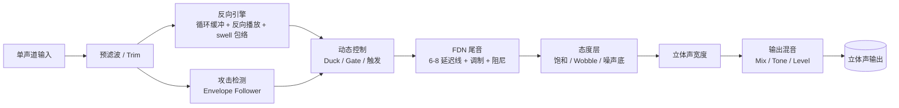

# Reverson — 动态 Reverse Reverb（Zoom G1on / ZDL）

- 日期：2026-08-12
- 状态：设计已获用户认可，进入实施准备
- 作者：用户 + Codex（协作设计）

## 1. 目标与定位

从零自研一个 reverse reverb 效果，最终以自定义 ZDL 形式运行在 **Zoom G1on**（ZDL 平台）上。
定位关键词：**激进现代创意、动态派（duck/gate）、shoegaze/indie 态度**。

开发顺序（用户确认）：
1. **VST3 原型**（Windows / JUCE）：先在 DAW 里把音色调到满意；
2. **ZDL 移植**（TI C6000）：同一份核心代码编译进 G1on，用 Zoom Effect Manager 通过 USB 写入。

> 核心 DSP 用便携 C（C99）编写，从第一天就遵守 ZDL 运行时约束，
> 保证 VST 与 ZDL 跑同一份算法，不存在"VST 好听、上机变味"。

### 成功标准
1. G1on 上加载不死机、参数调节无爆音/zipper 噪声、44.1kHz 稳定运行。
2. 与 G1on 原厂 ReverseRv 直接 A/B：动态咬合、尾音密度、态度上明显胜出。
3. DSP 预算留余量：效果链里还能再串一个 delay 不卡顿。
4. 可复现构建：一条命令出 VST3，一条命令出 ZDL。

## 2. 平台与约束

| 项 | 值 |
|---|---|
| 目标硬件 | Zoom G1on（ZDL 平台，44.1kHz，单声道进 / 立体声出） |
| 处理块 | 8 采样块（每块 8 左 + 8 右） |
| 效果链 | 最多 5 个同时效果 |
| 效果格式 | ZDL = TI TMS320C6x ELF32（ET_DYN）+ 元数据 |
| 构建工具链 | TI C6000 Code Generation Tools + repeat98/ZoomMultistompZDL 链接器 |
| 安装方式 | Zoom Effect Manager 2.3.3+（官方，明确支持 G1on）：从文件夹读取 ZDL → USB 写入 |

核心运行时约束（自研代码必须遵守）：
- 无堆（不用 malloc/free）；状态由宿主经 `ctx[3]` 托管区提供
- 无运行时除法 / `double` / `long long` 等会触发 `__c6xabi_*` helper 的运算
- 大数组不能放 `.fardata` / `.bss`，必须用 `ctx[3]` 大状态描述符（base/end/span）
- 保留 `ctx[11]` / `ctx[12]` 寄存器协议
- 效果文件名 ≤ 8 字符（唯一 basename）
- 多页 UI 编辑仍为实验特性：v1 先保单页（3 参数），多页后补

未验证项（平台风险）：
- G1on 上自定义 ZDL 尚未被社区实测（社区仅在 MS-70CDR 2.10 验证）→ 平台冒烟测试先行
- G1on 的 `ctx[3]` 可用容量未知 → 反向缓冲上限按实测收缩（设计 2s，可能落到 1-1.5s）

## 3. 算法架构

便携 C 核心（无平台依赖）→ 两个壳：
- 壳 A：**VST3**（JUCE，UI 镜像 G1on 编辑界面）
- 壳 B：**ZDL**（C6000，宿主调用约定）

### 信号流（单声道进 → 立体声出）

### 模块职责

1. **反向引擎**
   - 循环缓冲录制输入；反向读头 + 段间交叉淡化
   - 两种模式：连续反向（实时倒放最近过去）/ 触发式反向（攻击检测在拨弦起点重触发反向段）
   - Swell 包络曲线可调（线性 → 指数 → 陡峭）
   - **峰值自动归一化**（每段自动增益），保证 swell 电平稳定
2. **动态核心**
   - 同一个 envelope follower 驱动三件事：duck（弹时湿声下压）、gate（空隙放尾音）、触发（重触发反向段）
3. **FDN 尾音**
   - 6-8 线反馈延迟网络；慢速 LFO 调制延迟线（尾音流动）；弱化早期反射
   - 左右延迟线去相关 + 交叉馈送 → 宽立体声像；Tone = 高频阻尼 + 倾斜 EQ
4. **态度层**
   - 软饱和（磁带暖）、可选 wobble（反向读头慢速抖动）、可选噪声底；**只作用湿声**
5. **输出级**
   - Mix / Tone / Level / Width；参数一阶平滑（防 zipper）；输出限幅

## 4. 音色设计

**核心认知：reverse reverb 的"好听"是三个幻觉的叠加**
1. 时间倒流感（swell）：反向播放把衰减变成渐强；
2. 空间感（tail）：反向信号是干的，必须靠 FDN 扩散才有豪华感；
3. 动态呼吸感（态度）：swell 跟随演奏"吸气呼气"，这是与原厂的差异化。

**逐层设计原则**
- 反向引擎：触发式反向优先（音乐性），swell 曲线可调（Shape），峰值归一化防翻车，
  crossfade 平滑度 = 无缝 vs 短促 glitch
- 动态核心：duck 的 attack/release 塑造"咬合感"；gate 产生节奏 stutter
- FDN：调制尾音"流动"，弱化早期反射，立体声去相关
- 态度层：湿声饱和/wobble，干声保持干净
- 隐藏项：参数平滑、限幅、出厂预设（Slowdive / DIIV / Swell / Glitch / Tape）

## 5. 参数设计

| 页 | 旋钮 1 | 旋钮 2 | 旋钮 3 |
|---|---|---|---|
| P1 | Mix | Decay | Tone |
| P2 | RevLen（反向时长） | Duck（灵敏度） | Gate（阈值） |

扩展（后续页/隐藏）：Shape（swell 曲线）、Mod（尾音调制深度）、Sat（饱和量）、Width（立体声宽度）。
参数表为最终目标。v1 实现顺序：先 Mix/Decay/Tone 跑通，多页 UI 验证后再加 RevLen/Duck/Gate。

## 6. 开发阶段

- **A. 平台打通**：装 TI C6000 编译器 → 跑通 repeat98 构建 → 最小 gain.ZDL 刷进 G1on →
  验证加载/出声/参数/预算/死机风险；实测 `ctx[3]` 容量。交付：可复现的"编译-导入-验证"闭环 + G1on 平台笔记。
- **B. VST 原型**：便携 C 核心 + JUCE VST3 壳 + 镜像旋钮 UI；DAW 里迭代音色。
- **C. ZDL 移植**：核心编译进 C6000（ctx[3] 状态、8 采样块、无除法）→ 上机迭代 → 与原厂 ReverseRv A/B。
- **D. 打磨**：参数/预设/多页 UI/预算优化（视 C 阶段结果决定）。

## 7. 分工

- **Codex**：工具链搭建、便携 C 核心、VST 壳、ZDL 构建脚本、测量工具、文档。
- **用户**：音色把关（DAW 测试）、G1on 硬件验证、A/B 听感决策。

## 8. 风险与缓解

| 风险 | 缓解 |
|---|---|
| G1on 自定义 ZDL 未验证 | 阶段 A 冒烟测试先行；备选 MS-70CDR |
| ctx[3] 容量未知 → 反向缓冲受限 | 编译期可调最大长度，按实测收缩 |
| 多页 UI 实验性 | v1 单页；多页后补 |
| JUCE 许可（GPLv3） | 个人测试无碍；未来分发需开源或商用授权（备选 iPlug2） |
| 设备为未验证机型 + 刷写风险 | 先备份原厂效果清单，按社区安全流程操作 |

## 9. 参考

- repeat98/ZoomMultistompZDL（自定义 ZDL 工具链）：https://github.com/repeat98/ZoomMultistompZDL
- g200kg/zoom-ms-utility（patch/MIDI 协议）：https://github.com/g200kg/zoom-ms-utility
- fjl/Zoom-Firmware-Editor（固件效果注入）：https://github.com/fjl/Zoom-Firmware-Editor
- Zoom 官方《效果文件编辑说明》PDF（zoomeffectmanager.com）

